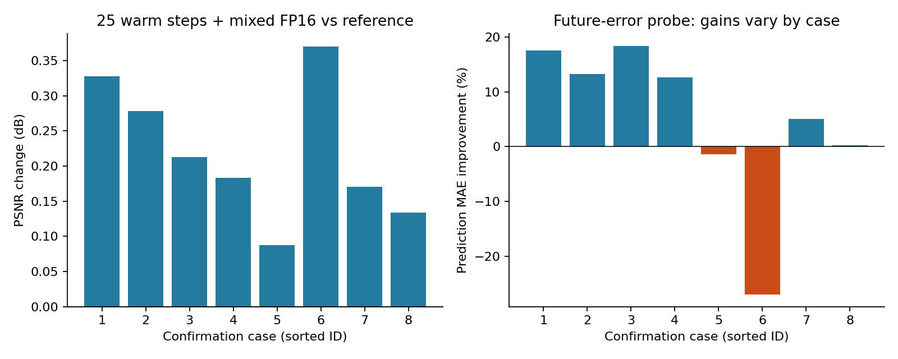
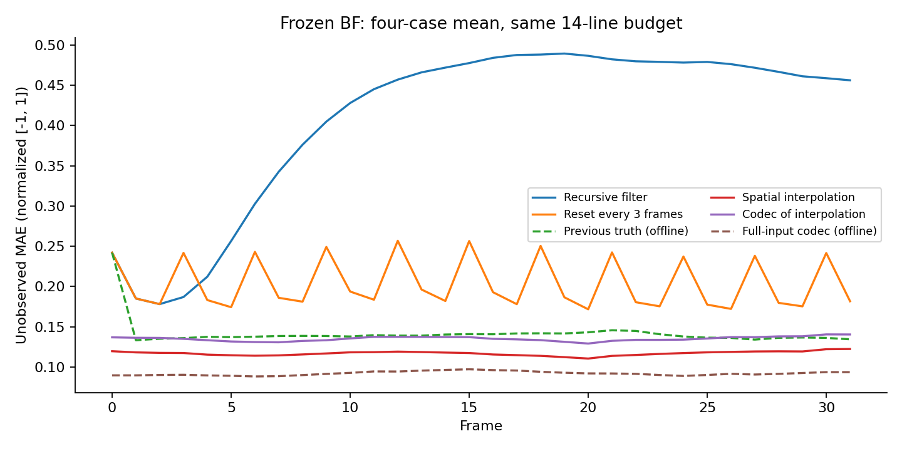

# 准备实验结论与下一步

2026-09-19；对象：`preparation_followup_v3`。本报告解释已有结果，不增加 GPU 实验，也不修改已完成实验的权重、配置和判定门槛。

**当前可以继续推进预测式主动采集主线，但还不能把现有小型闭环当作创新点已成立的证据。** CASL 加速方案已具备日常开发使用的依据；未来误差预测出现了值得继续验证的信号；BF 当前实现暴露出明显的递归退化。最紧迫的工作是让预测器接触不同预算，并建立公平的预算对照，而不是完整重训 CASL、重写 PyTorch 或直接增加复杂规划模块。

## 1. 这轮实际完成了什么

9 个计算任务均完成：原版与加速版确认、BF 冻结诊断、train/development 风险轨迹、confirmation 轨迹复用、风险预测探针、同历史分支、小型预算闭环。任务累计墙钟约 785.6 秒（13.1 分钟），不含此前准备、报告、打包和下载，不能视为整个项目只花了 13 分钟。

本轮没有重训 CASL，也没有继续训练 BF。BF 直接加载上一轮已完成的 checkpoint，训练更新次数为 0。报告阶段出现的新旧数组字段不兼容已单独修复，没有重跑计算、改动实验结果或覆盖实验身份记录。

CASL 设置为官方预训练权重、112×112 极坐标图像、每帧 14 条线、2 个后验样本、时间窗口 3、两个固定随机种子。确认集是 8 个新的 validation 病例，每例 56 帧；与前一轮验证用途病例不重叠。**896 个帧次不是 896 个独立病例，且本轮没有使用 test。**

TBIG 本轮没有运行；官方仓库、环境及资产仍未接入。因此没有 TBIG 的性能、优劣或加速结论。学长方案也是无原代码、无原权重的论文启发实现，不能把它的当前表现归因于学长论文的方法上限。

## 2. CASL：可以采用已通过检查的加速配置

| 比较项 | 本轮结果 | 如何解释 |
|---|---:|---|
| 同步热态算法时间 | 77.91 → 31.07 ms/帧 | 约 2.51×；排除冷启动与首次热态调用 |
| 适配层计时加速 | 2.15× | 更接近调用开销，仍不等于整套流水线加速 |
| 两个确认任务总墙钟 | 174.1 → 133.6 秒 | 本小任务约 1.30×，包含加载、编译、输出等开销 |
| 病例平均 PSNR 差值 | +0.220 dB | 此样本下没有平均下降 |
| 病例平均 SSIM 差值 | +0.00416 | 此样本下略高 |
| 未观测区域 MAE 比值 | 0.9798 | 加速版约低 2.02% |
| 最差病例 PSNR 差值 | +0.0877 dB | 8 个病例的病例平均 PSNR 都略高 |
| 当前不确定性—误差关联 | 0.559 → 0.618 | 病例内 Spearman 相关的平均值；不是校准保证 |

胜出配置是 `official25_fp16`：**热启动从 50 次反向更新缩为 25 次，并使用 mixed FP16；首帧仍然是 500 步冷启动。** 它不是“全程只有 25 步”，也不是“已经证明 50 步里只做 5/10 次 DPS 就足够”。稀疏 DPS 是另外的候选，本轮没有重新比较它。

本轮 PSNR/SSIM 按极坐标图像转 uint8 后计算，MAE 使用原归一化浮点值；没有在本轮补做 LPIPS、分割或临床任务指标。因此质量准入限于所测指标。

这两个变化同时存在，本轮也不能单独归因于减步或 FP16。轻微指标改善可来自采样轨迹、随机性和重建变化，不应宣传为普遍提升质量。

**实际决定：**相同数据域、预算和时间设置下，日常实验默认用该加速配置；保留一小批原版锚点。换卡、更换预算范围、后验样本数、模型或数据域后重新做短程数值、质量和计时检查。无需为提速先迁移到 PyTorch。此前图编译校准已证明，现有框架仍有可利用的加速空间，详见相邻目录的 `hardware_autotune_20260919.md`。



左图为加速版相对原版的病例平均 PSNR 差值；右图为未来误差预测相对简单参照的病例增益。两图均是描述性结果，不是正式统计非劣检验。

## 3. 未来误差预测：值得继续，但尚未证明预算决策收益

线性探针使用当前可观测特征预测下一帧未观测区域 MAE。特征包括不确定性的均值、90% 分位数和标准差、观测残差、图像变化、预算比例。下一帧真值只用于离线监督标签，不作为在线输入。

训练有 32 个病例、1984 个相邻帧对；development 有 4 个病例、248 对；confirmation 有 8 个病例、880 对。训练与验证病例分开。参照从简单模型中按 development 选出，胜出的是当前不确定性参照。

| 预测 MAE（越低越好） | 当前不确定性参照 | 多特征线性模型 |
|---|---:|---:|
| development | 0.010855 | 0.011117 |
| confirmation | 0.013469 | 0.012497 |

confirmation 相对改善 **7.215%**，达到预先设定的 5% 门槛，因此程序按计划接着运行分支和闭环。**development 上多特征模型反而略差，必须同时保留这个事实。** 这说明当前证据仍有病例依赖，不能把一次确认通过当作稳健性已经解决。

本地按病例复算后，confirmation 的 8 例有 6 例改善、2 例变差。其中一例相对恶化约 26.95%，但其预测 MAE 的绝对增加仅约 0.000493（0.001828 → 0.002320）；相对比例和绝对变化都应报告。病例明细见 [risk_per_case.csv](risk_per_case.csv)，复算总分与服务器保存值一致。

这里衡量的是“对重建误差的预测是否更准”，不是“重建图像误差下降 7.2%”，也不是“省了 7.2% 扫描线”。同样，预测固定策略下的未来误差，不等于能回答“多给 7 条线能改善多少”。后者需要预算或动作条件下的结果模型，或者直接受控比较。

**实际决定：**保留该轻量模型作为后续基线，暂不升级为大型时序模型。优先检查它在不同预算下能否保持可靠，并和当前不确定性等简单策略比较真正的决策收益。

## 4. 动态预算闭环：已跑通，但发现一个明确的适用范围问题

探索性闭环只有 2 个病例 × 2 个种子 × 16 帧，复用了 confirmation 病例。所有策略使用相同的等间距空间选线规则，只改变每帧采多少条线；它不是完整 CASL 选线规则下的最终新方法。

| 病例 | 自适应总线数 | 固定 14 条/帧总线数 | 自适应未测 MAE（两种子平均） | 同总量随机时序 MAE |
|---|---:|---:|---:|---:|
| 0X133BD3C195F9EA2 | 168 | 224 | 0.07971 | 0.08069 |
| 0X11A07A83B21CFE1E | 259 | 224 | 0.08787 | 0.09423 |

自适应相对同总量随机时序在两例上均较好，说明有继续做受控验证的理由。第一例少用 25% 扫描线，第二例却多用 15.625%；**不能把第二例相对固定 14 条的误差下降全部归功于策略，它还用了更多观测。** 两例总预算合计比固定方案少约 4.69%，但不能将两例汇总包装成一般节省率。

更重要的是：每个病例/种子片段有 7/16 帧回退到固定 14 条，总计 28/64 帧。核对逐帧记录后，这 28 次全部由 `budget_fraction` 超出训练范围触发。训练轨迹的预算恒为 14/112=0.125；只要上一帧用了 7 或 28 条，下一帧的预算比例就超出训练范围。当前闭环因此经常出现“改变预算—回退”的交替。

这是输入覆盖不足被保护检查暴露出来，不是模型已学会复杂的交替预算规律。**下一轮必须解决训练数据只覆盖固定预算的问题，不能简单删除越界检查。**

此外，同总量随机参照是把完整自适应预算序列事后打乱得到的，适合检查时序安排是否重要，但使用了事后确定的总量；它不是可部署的在线预算对照。自适应首个片段还承担编译开销，不能直接用各策略累计时间比较谁推理更快。

不同预算对应不同未测像素集合。除保留原始未测 MAE，本地分析另行计算全图 MAE和三种策略都未观测到的共同像素 MAE，见 `analysis.json`。这些是事后敏感性分析，没有回写门槛，也不能替代新病例确认。

| 病例 | 全图 MAE：自适应 / 同总量随机 | 共同未测区域 MAE：自适应 / 同总量随机 |
|---|---:|---:|
| 0X133BD3C195F9EA2 | 0.07224 / 0.07316 | 0.08256 / 0.08330 |
| 0X11A07A83B21CFE1E | 0.07586 / 0.08144 | 0.08902 / 0.09501 |

两种补充口径下方向仍一致，但样本仍然只有两例，不能据此升级为已确认有效。

## 5. 学长方案启发的 BF：先处理递归退化，不宜盲目续训

本轮固定上一轮 filter 权重，在 4 个开发病例、每例 32 帧、同样 14 条线下比较。误差均在归一化 [-1,1] 图像域计算，以下数值不是临床误差，也不是百分比。

| 条件 | 平均未测 MAE | 用途 |
|---|---:|---|
| 正常递归 filter | 0.4080 | 当前在线实现 |
| 每 3 帧清空状态 | 0.2035 | 定位长递归影响 |
| 上一帧真值 latent | 0.1418 | 仅离线诊断，线上无法获得 |
| 同预算空间插值 | 0.1169 | 必须保留的简单参照 |
| 插值图经 codec | 0.1351 | 检查 codec 对部分观测填充图的影响 |
| 完整输入经 codec | 0.0920 | 使用完整真值的离线诊断，非在线基线 |

正常递归的前 3 帧平均误差为 0.2017，后 16 帧升为 0.4765；每 3 帧重置后的后段误差为 0.1988。重置大幅缓解问题，但仍不及空间插值。使用真值历史仍不及插值，说明也不能把全部问题只归结为历史累积；更新模块、训练分布和表示质量都需要检查。

完整输入 codec 的较低误差说明其在该输入条件下有一定重建能力，**不构成不可突破的理论误差下界**。插值经过 codec 反而变差，也不支持“多接一个模块一定更好”。



实线为可实现条件；虚线使用真值信息，只用于诊断。图中是 4 个病例的平均曲线。

**实际决定：**学长路线暂时作为旁支。先检查短片段训练与连续部署的历史分布是否一致、状态初始化和传递是否正确、观测更新能否稳定优于插值。保留零历史/周期重置/插值参照，必要时做一个固定预算的小型训练对照。当前结果不支持直接加长训练，更不支持宣称学长方法不可行或已被复现失败。

## 6. 同历史分支：预算有作用，复杂规划尚缺乏足够收益证据

分支来自 2 个病例、每例 2 个相同历史快照、2 个随机种子；不是 8 个独立病例。在相同历史下，下一帧等间距采样的未测 MAE 平均值为：

| 线数 | 7 | 14 | 28 |
|---|---:|---:|---:|
| 未测 MAE | 0.07335 | 0.06468 | 0.05155 |

这说明在选定快照上增加观测平均有帮助，但只有少量状态，且不同预算的未测区域不同；不能直接得到可靠的个体预算需求曲线。

同预算动作分支比较 greedy、uniform、random、top-k 等有限候选的两帧结果。greedy 相对候选中事后最优的平均差距仅 0.000667；8 个“状态×种子”里有 4 个存在差距，集中在同一个病例，另一个病例的 greedy 已是这些候选中最好的。它不是全局最优性检验，也不是一个已训练的规划器。

**实际决定：**现阶段优先把预算决策和分布覆盖做实；暂不因为“greedy 可能短视”就直接投入复杂 world model 或长时域搜索。

## 7. 建议按这个顺序推进

| 优先级 | 下一步 | 要回答的问题 / 停止条件 |
|---|---|---|
| P0 | 在训练病例上补齐 7/14/28 条的受控轨迹，固定空间规则；保留越界记录 | 预测器是否仍能在改变预算后工作，而非依赖回退？这是闭环适用性准备 |
| P0 | 预先规定总预算约束，比较固定、随机、当前不确定性、多特征预测策略；用新病例确认 | 在相同总采样量下，预测真的比简单策略更有用吗？若没有，不继续堆模型 |
| P0 | 同时报全图误差、未测误差、共同支持区域误差、低质量帧比例、回退比例与总线数 | 避免均值或不同评价区域掩盖不稳定性；质量阈值提前固定 |
| P1 | 冻结重建主干，比较轻量风险模型与预算条件模型；先明确目标是预测风险还是预测追加观测收益 | 固定策略的误差预测不应直接冒充行动价值预测 |
| P1 | BF 单独做一个受控的递归稳定性修正对照 | 若仍不能超过同预算插值，就暂缓这条实现路线，不无限续训 |
| P2 | 正式需要 TBIG 比较时再接入资产并做小规模接口/结果核对 | 当前没有 TBIG 证据，不能写入性能比较表 |

新实验继续使用已通过检查的 CASL 加速设置和实际硬件预检。只保留少量原版锚点，不做全测试集扫表或完整重训。动态预算候选最终确定之后，再投入正式留出病例和论文级对照。

公平比较可分成两个预先固定的问题：在相同总线数上比较质量，或在同一个预定质量要求上比较线数。前者应在决策时就约束剩余预算，不能等看到结果后再筛选总量相近的片段；后者不能按确认集效果事后挑质量阈值。

上述是从本轮证据得出的先后顺序，不是已经确认的新颖性主张。按照你当前的研究方式，进入具体创新点前仍应单独明确假设、相关方法差异和评价协议；这轮准备结果已经足够支持开始这一步。

## 8. 证据与归档

**下载已完成，SHA-256 与服务器一致，全部 5440 个文件已成功解包。现在关闭 AutoDL 实例不会中断本轮实验或下载。** 本地结果包为 2,758,247,204 字节；解包内容合计 2,770,907,740 字节。

- [完整结果包](../../outputs/preparation_followup_20260919/preparation_followup_v3.results.tar.gz)
- [下载与解包校验记录](../../outputs/preparation_followup_20260919/download_verification.json)
- [原始实验报告](../../outputs/preparation_followup_20260919/unpacked/preparation_followup_v3/REPORT.md)
- [本地数值复核与回退原因](analysis.json)

SHA-256：`62a80ae5f1ba2010a3a0c80f808694e7092fd4e0b9601802b9e7afe9f30df6ed`。

- 本报告中的主要数字来自下载的 `selection.json`、`frames_summary.csv`、各任务 `result.json` 和逐帧 NPZ。
- `analysis.json` 保存本地复核结果、按病例差异、BF 早晚阶段误差和逐帧回退原因；`risk_per_case.csv` 保存预测结果的病例级分解。
- 本地分析脚本为 `scripts/summarize_followup_results.py`。简单风险参照只用归档的 train 行按原 ridge 规则重算，并与已存 development/confirmation 总分核对；没有重新选择参照或阈值。
- 原始结果包保留，不删除服务器数据，不覆盖原始报告或实验目录。
- 本轮结果包包含轨迹、指标、配置和来源哈希，不自动包含完整 EchoNet 数据、CASL 官方资产或上一轮继承的 BF 权重；这些仍在服务器原目录。关机与删除实例/数据是不同操作。

本地复算命令（在项目目录执行）：

```powershell
.\.venv\Scripts\python.exe -X utf8 scripts/summarize_followup_results.py --input outputs/preparation_followup_20260919/unpacked/preparation_followup_v3 --output reports/preparation_conclusions_20260919
```
