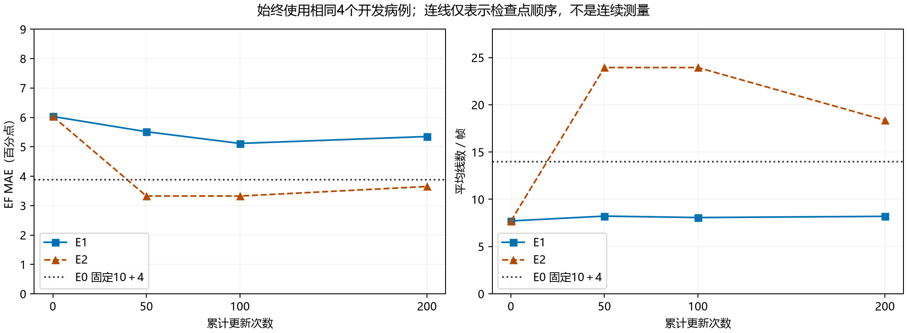
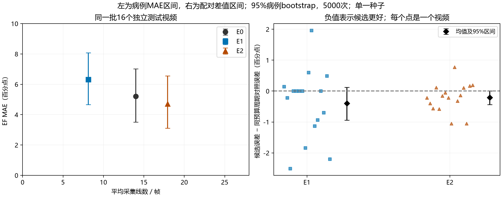
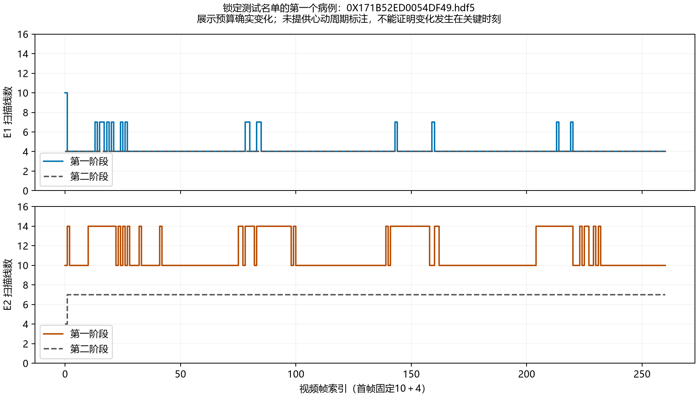

# 射血分数任务驱动的两阶段动态采样预算实验报告

报告日期：2026年10月10日。实验批次：`task_budget_ef_repair_v4`。实验代码提交：`a4d1a5c`。

本轮在冻结 CASL 扩散权重和 EchoNet 射血分数模型的条件下，对固定预算 E0、近似梯度学习预算 E1、强化学习预算 E2 进行比较。目标是检查两阶段动态预算的实现、训练信号和完整视频评价流程，并获得下一阶段实验设计所需的初步观察。本轮是小规模探索，不承担正式创新有效性认证。

**实现与执行已经跑通，动态分配的有效性仍未确立。** 18项任务全部完成，E1、E2各完成200次真实优化器更新；独立测试集16个视频的三组评价和同预算周期对照均完成。E1主要减少采集线数，EF误差和重建误差增大；E2主要增加线数，EF及重建质量改善。与各自严格匹配预算组合次数的周期对照相比，两者的平均EF误差都有小幅下降，但病例级95%置信区间均包含零。

本轮的主要价值是建立了可以核对的实验链条，同时暴露出三个值得保留的问题：训练时随机采样与部署时确定性决策的差距；第二阶段预算在最终测试中保持固定；减少扫描线数没有显著减少当前模拟流水线的GPU计算时间。不能把这些现象直接归因于预算权重、训练不足或近似梯度中的任意一个因素。

## 一 研究问题与比较对象

研究问题是：在连续心超视频中，能否利用历史和当前部分观测，学习每帧两阶段应该采集的线数，将资源安排在更有助于EF预测的时刻？

比较三种预算方式时，扩散模型、EF模型、任务选线评分、重建设置和随机键规则保持共同协议。学习式控制器只改变线数，不训练扩散主干，也不训练EF模型。

| 方法 | 第一阶段预算 | 第二阶段预算 | 训练内容 |
|---|---|---|---|
| E0 | 固定10条 | 固定4条 | 无预算控制器训练 |
| E1 | 第一个MLP决策头输出 | 第二个MLP决策头输出 | 直通Gumbel Softmax加显式局部投影近似梯度 |
| E2 | 第一个MLP决策头输出 | 第二个MLP决策头输出 | REINFORCE，视频片段级奖励 |

两个决策头合计1129个可训练参数，每个头使用12项可观测统计量、32单元隐藏层。它们属于一个预算策略，不是两个新扩散模型。

**这里的E0是共同任务驱动底座上的固定预算参照，不是原始CASL论文的完整基线复现。** E0同样使用TBIG风格的EF任务评分；本轮也不是TBIG原论文实验的完整复现。因而不能把结果直接放进原论文表格，声称与其工作点等价。

## 二 实际执行的数据与设置

### 数据划分

原始输入为EchoNet Dynamic，沿用已经转换完成的CASL极坐标HDF5数据。名单在计算结果之前锁定，并记录文件哈希。

| 用途 | 视频数 | 来源约束 | 实际使用方式 |
|---|---:|---|---|
| 策略训练 | 32 | EchoNet TRAIN与CASL train交集 | 每次随机选一个视频，再随机取连续片段 |
| 开发评价 | 8 | EchoNet VAL，且处于CASL的未训练划分 | 50、100次检查点使用前4个；200次使用全部8个 |
| 独立确认评价 | 16 | EchoNet TEST，且处于CASL的未训练划分 | 固定200次检查点，完整视频评价 |

三组名单互不重叠。CASL与EF预训练划分隔离依赖已登记的官方权重来源假设，不声称独立审计了作者的全部预训练过程。输入特征标度只使用已有TRAIN病例审计轨迹拟合，开发和确认病例不参与拟合。

32个训练视频的EF标签范围为22.99—79.13，8个开发视频为15.53—71.37，16个确认视频为42.77—79.71。因此，**本轮独立确认结果没有覆盖EF低于42.77的病例**；小样本的标签覆盖不能代表整个数据集。

### 共同计算设置

| 项目 | 实际值 |
|---|---|
| 粒子数与历史窗口 | 2个粒子，扩散输入窗口3 |
| 扩散精度 | FP32，TF32关闭 |
| 冷启动 | 视频或训练片段首帧第一阶段500步 |
| 热启动 | 每次后验更新25步，DPS逐步执行 |
| 第一阶段候选 | 4、7、10、14条 |
| 第二阶段候选 | 0、2、4、7、14条 |
| 单帧最大总预算 | 28条，第二阶段排除已采位置 |
| 共同首帧预算 | 10＋4 |
| EF模型 | 冻结的官方R(2+1)D 18，32帧输入、间隔2 |
| 离线视频EF | 固定步长16的片段预测取平均，末尾按协议补窗口 |
| 训练片段 | 上限64帧；实际63或64帧 |
| 训练设置 | 种子42，预算权重2，Adam，学习率0.003，梯度裁剪阈值5 |
| 检查点 | 累计50、100、200次更新，续训而非三次从零训练 |
| GS反向温度 | 前50次由1降至0.3，之后保持；硬动作训练使用随机探索，评价使用argmax |
| 工程执行 | 2线程、非压缩IPC、eager EF、eager GS、串行病例 |
| 实际硬件 | GPU名称报告为RTX 4080 SUPER；驱动报告显存32760MiB；CPU配额12核；内存限制约62GiB |
| 软件 | JAX/JAXlib 0.6.2、Keras 3.12.4；独立任务环境Torch 2.8.0＋cu128 |

25步热启动是已显式选择的近似配置，三组都在这一底座上重建参照，并不等价于官方50步工作点。本轮CASL推理实际使用JAX后端，EF使用独立Torch进程；不能把历史TensorFlow训练环境误写成本轮正在训练的模型。

硬件身份检查认为本轮与旧批次不兼容，实际继承的E0病例数为零，因此E0已在本轮硬件上重新评价。旧模型结果没有改名混入本轮。

## 三 两阶段闭环与两个EF结果的含义

### 在线执行顺序

1. 由过去重建、粒子不确定性、因果EF特征和过去预算形成第一阶段状态。
2. 控制器决定第一阶段线数；共同选线规则排序，获取相应数量的真实模拟观测，执行第一次后验重建。
3. 由第一阶段观测与中间后验更新状态；第二个决策头决定补采线数。
4. 按同一任务评分规则选择尚未采集的位置；补采数量大于零时执行第二次后验更新。
5. 将最终重建与观测历史传给下一帧。首帧共同固定10＋4。

任务评分使用粒子图像方差乘以粒子平均EF输入梯度的平方，再沿深度汇总，并使用既定的贪心邻域抑制。策略状态不使用当前完整图像、EF真值或未来帧；这些数据只用于模拟采集、监督训练损失与离线评价。

数量变化会改变实际观测与重建，继而改变下一帧状态、任务梯度及选线排序。所以“选线规则未变”不意味着“选线位置始终相同”。随机扩散键按片段种子、帧与阶段确定，不随控制器消耗多少随机数而改变。

### 学习策略与同预算周期对照

同预算周期对照不是第二个E1模型。它统计学习策略整段视频使用各种预算组合的次数，然后将这些组合重新安排成不读取图像或任务误差的周期序列。

| 暖帧示意 | 学习策略 | 周期对照 |
|---|---|---|
| A | 4＋4 | 4＋4 |
| B | 7＋4 | 4＋4 |
| C | 4＋4 | 7＋4 |
| D | 4＋4 | 4＋4 |

这张表只是机制示意。两边各种组合的次数、第一阶段与第二阶段资源总量、第二阶段调用次数均匹配，但组合所在时刻不同。真实对照对每个视频分别严格匹配，首帧仍共同固定10＋4。本轮检查全部确认病例的组合计数一致，总线数差为零。

若逐帧预算、初始状态、噪声与规则都相同，“提前指定预算”和“现场决定相同预算”应当等价。真正比较的是**同样资源的时间安排**，不是预算数字从哪个函数传进来。恒定策略与其周期对照完全相同时复用同一物理推理结果，不虚构一次新的测速。

该对照是事后资源匹配的诊断工具，需要先知道学习策略的整段预算分布，不是一个预先部署的独立预算预测器；也没有搜索所有可能的预算排列。

## 四 修复后的学习协议与训练健康检查

### E1的近似梯度

真实硬前向仍执行CASL采样。外层预算训练使用`local_projection_v2`：缓存真实最终重建，对候选掩膜变化构造局部观测投影近似；后验、跨帧历史和离散排序在这一反向过程中固定。创新残差使用有界原始预测，第一、第二批掩膜以并集组合，避免重复计算相同位置的补采收益。

这是**明确的近似学习算法**，不是原来完整DPS反向的等价修复。新检查中的硬前向及AD原值误差为零，只说明这个声明的近似路径保留了真实硬前向，不证明它准确描述“换预算后真实后验会怎样变化”。非零任务梯度也不保证其方向长期有效。

### E2的奖励

共同目标函数为：

```text
L = 视频片段EF绝对误差（百分点） + 2 × 片段平均线数 / 112
```

E2在奖励中加入同一完整输入片段的EF误差作为与动作无关的参考，用之前片段的超额奖励EMA作为baseline，并将动作对数概率和除以固定126。完整输入参考只出现在离线训练，不能在部署时提供未采集的当前图像。参考不改变理想期望目标中的动作排序，但有限步Adam更新、方差和梯度裁剪行为会受这些训练处理影响。

E1、E2都采用新状态标度和新学习协议，因此没有直接续用旧控制器权重。仅训练预算控制器，不完整重训CASL或EF。

### 实际200次更新

200次更新不是200个epoch。每次从32个视频中有放回地抽取一个视频、一个连续片段，运行采集闭环后更新一次。两方法使用相同的病例、起始位置、片段长度和动作种子序列；各自闭环重建仍独立。

| 项目 | E1 | E2 |
|---|---:|---:|
| 真实更新次数 | 200 | 200 |
| 实际触达训练视频 | 32／32 | 32／32 |
| 累计片段帧处理次数 | 12795 | 12795 |
| 视频抽到次数范围 | 2—11次 | 2—11次 |
| 梯度范数中位数 | 0.2795 | 0.1706 |
| 梯度范数最大值 | 2.4482 | 1.2922 |
| 触发梯度裁剪 | 0次 | 0次 |
| 每次更新中位耗时 | 34.76秒 | 29.93秒 |
| 累计训练进程时间 | 117.12分钟 | 101.61分钟 |

所有50、100、200次检查点的参数与Adam状态均为有限值，步数与端点相符；两个决策头在50到200次之间继续变化。E1的200次更新中，两个头的任务梯度均非零，硬前向及近似AD原值误差最大值均为零。

这些证据支持“模型确实在训练，之前的梯度爆炸和原值漂移没有出现在这条新路径上”。它们不支持“训练充分”“已收敛”或“梯度估计与完整闭环等价”。每个训练视频平均只抽到6.25个片段，而且每段重新冷启动；完整视频评价会持续累积更长历史，这也是训练与部署分布差异之一。

## 五 开发检查点结果

为了比较训练进程，这里始终使用相同的前4个开发病例；200次检查点从最终8病例评价中取回这4个病例，避免名单变化造成误读。

| 方法与累计更新 | EF MAE（百分点） | 平均线数／帧 | 同预算周期对照EF MAE |
|---|---:|---:|---:|
| E0 固定10＋4 | 3.8743 | 14.000 | 不适用 |
| 共同未训练控制器 | 6.0312 | 7.712 | 5.7887 |
| E1 50次 | 5.5129 | 8.222 | 4.8482 |
| E1 100次 | 5.1145 | 8.070 | 4.7267 |
| E1 200次 | 5.3494 | 8.197 | 4.8582 |
| E2 50次 | 3.3249 | 23.940 | 3.3249 |
| E2 100次 | 3.3249 | 23.940 | 3.3249 |
| E2 200次 | 3.6499 | 18.360 | 3.5660 |



图中连线仅表示检查点顺序，不代表检查点之间进行了连续测量，也不证明单调收敛。E1从未训练到100次有改善，200次略回升；不能把开发8病例的5.8185与前4病例的5.1145直接相减，判定明显退化。

E2在50与100次的结果完全相同，逐帧轨迹表明两次评价的全部678个暖帧都使用10＋14。训练参数继续变化，但argmax选出的动作尚未改变，因此两次物理推理相同；这不是“优化器没有更新”。200次开始采用较少的17或21条暖帧预算，质量也随之改变。

四病例结果只承担实现和趋势检查。本报告没有据此挑选最佳检查点或扩大搜索；独立确认仍按原先冻结的200次端点执行。

## 六 最终独立确认结果

确认集为同一批16个完整视频，共2796帧，单视频113—261帧。所有方法使用同一个训练种子42。以下指标先在每个视频内部汇总，再对视频等权平均；2796帧不作为2796个独立统计样本。

### EF与重建质量

| 方法 | EF MAE（百分点） | EF RMSE | 平均线数／帧 | PSNR（dB） | SSIM | 浮点MAE |
|---|---:|---:|---:|---:|---:|---:|
| E0 | 5.2051 | 6.3093 | 14.000 | 24.3044 | 0.7660 | 0.06732 |
| E1 | 6.3182 | 7.2204 | 8.122 | 22.0468 | 0.6806 | 0.08996 |
| E2 | 4.7131 | 5.9177 | 17.942 | 25.3061 | 0.7994 | 0.05897 |

EF MAE的95%病例bootstrap区间分别为：E0 `[3.5136, 7.0169]`，E1 `[4.6713, 8.0730]`，E2 `[3.1028, 6.5608]`。只覆盖病例抽样不确定性，不覆盖训练种子变化。

E1相对E0平均少采41.98%的线，EF MAE增加1.1131个百分点，PSNR下降2.2576dB。E2相对E0多采28.16%的线，EF MAE降低0.4920个百分点，PSNR提高1.0017dB。直接比较混合了资源数量、阶段组合和时间安排的影响，不能据此认定E2的动态时机优于E0。

追加的病例级配对分析中，E1减E0的EF误差差值区间为 `[0.3866, 1.8254]`，E2减E0为 `[-1.1625, 0.0583]`。前者在本次描述性分析中体现明确的损失方向；后者仍不排除零。该分析是实验结束后的报告补充，未进行多重比较校正，不扩张为正式非劣效或临床结论。

PSNR、SSIM在极坐标域按共同协议将图像从−1到1截断映射为uint8后计算；浮点MAE直接使用归一化浮点图像。两者量纲不同。各自未观测区域MAE为E0 0.07694、E1 0.09699、E2 0.07020，但三组掩膜不同，这不是“共同未观测区域”的严格比较。更多真实观测像素也会直接降低全图误差，不能把全部重建指标改善归因于生成模型更强。

### 同预算时间安排比较

| 方法 | 学习策略EF MAE | 同预算周期对照EF MAE | 学习策略减对照 | 95%配对bootstrap区间 | 更好／相同／更差病例数 |
|---|---:|---:|---:|---|---|
| E1 | 6.3182 | 6.7128 | −0.3946 | `[−0.9415, 0.1187]` | 7／5／4 |
| E2 | 4.7131 | 4.9245 | −0.2114 | `[−0.4403, 0.0053]` | 11／0／5 |

负值表示学习策略更好。两组预算匹配均通过逐帧组合计数检查，线数误差为零。E1有5个视频使用恒定暖帧预算，因此与其周期对照完全相同，误差差值为零是预期结果。



左图展示真实工作点，未插值构造预算曲线；右图展示全部16个病例差值及均值区间。统计使用5000次病例重采样，种子20261008。E2区间上界仅略高于零，也必须如实保留；不能通过取整、改单侧检验或删除病例将其变为“已经有效”。

本轮观察到平均有利的时间安排信号，但证据仍不足。小样本检查点出现过反方向结果，也说明不能用某一个早期病例集合替代最终判断。

## 七 策略实际学到了哪些动作

以下统计只计确认集2780个暖帧，排除16个共同初始化帧。

| 方法 | 暖帧预算组合及次数 | 平均预算切换率 | 暖帧恒定预算的视频 |
|---|---|---:|---:|
| E0 | 10＋4：2780次 | 0 | 16／16 |
| E1 | 4＋4：2700次；7＋4：77次；14＋4：3次 | 3.03% | 5／16 |
| E2 | 10＋7：2065次；14＋7：715次 | 17.87% | 0／16 |

E1的97.12%暖帧使用4＋4，第一阶段偶尔增加，第二阶段始终为4。E2的74.28%暖帧使用10＋7，其余25.72%为14＋7，第二阶段始终为7。

**两阶段决策已经实现，但在当前参数和数据下，最终变化主要发生在第一阶段，第二阶段没有表现出按帧变化。** 两者均未选择零补采，不能利用跳过第二次后验更新来减少计算。预算切换率是视频内暖帧相邻组合发生变化的比例，先按视频计算再平均；切换得多不等于采集时机更正确。



图中病例由锁定名单的第一个病例确定，没有挑选效果最好或变化最多的病例。E1第一与第二阶段在预算4处重合；E2第二阶段保持7。没有心动周期阶段标注或独立任务价值标签与这些轨迹对齐，因此不能声称预算增加发生在收缩末期、舒张末期或其他关键时刻。

末次训练片段的平均最大动作概率，E1第一头约0.330、第二头约0.911；E2第一头约0.323、第二头约0.305。这些是训练片段上的统计，不是全测试集概率校准。它们与“E1第二头高度偏向一个预算、第一头仍有较强随机探索”的观察相容。

## 八 计算资源与速度

### 整轮与单任务时间

总墙钟时间24459秒，即6小时47分39秒。18项任务包括1项启动探测、6项分段训练、8项开发评价、3项独立确认评价。它们不是18个不同超参数工作点。

E1累计训练约1小时57分钟，E2约1小时42分钟，两者合计约3小时39分钟。其余时间主要用于完整视频评价及额外周期对照，不应全部归入“控制器训练很慢”。

| 确认集主流程计时 | E0 | E1 | E2 |
|---|---:|---:|---:|
| 视频平均时间（秒） | 77.99 | 77.44 | 77.53 |
| 视频时间中位数（秒） | 74.02 | 73.24 | 73.92 |
| 视频时间p95（秒） | 110.99 | 110.59 | 109.54 |
| 暖帧时间中位数（秒） | 0.4350 | 0.4331 | 0.4333 |
| 暖帧时间p95（秒） | 0.4428 | 0.4416 | 0.4407 |
| 总帧数／主流程总时间得到的FPS | 2.241 | 2.257 | 2.254 |
| 每组感知更新调用总数 | 5592 | 5592 | 5592 |

这些是预加载完整视频的采集闭环加最终EF预测，包含任务评分及IPC往返；外部HDF5读取、整视频参考评价和额外周期对照未包含在这一主流程视频时间中。首次加载／编译及整个任务开销体现在进程和整轮墙钟记录中。单次计时的约0.6%—0.7%差异不能认定为稳定提速。

### 主要开销在哪

确认集每个视频平均耗时分解为：

| 部分 | E0（秒） | E1（秒） | E2（秒） |
|---|---:|---:|---:|
| 因果EF任务评分及输入梯度服务 | 58.01 | 57.37 | 57.43 |
| CASL感知更新 | 18.10 | 17.83 | 17.86 |
| 预算控制器 | 0.44 | 0.94 | 0.96 |
| 最终整视频EF预测 | 0.25 | 0.24 | 0.24 |
| 外部HDF5读取，另记 | 0.069 | 0.062 | 0.064 |

EF评分服务占主流程约74%，包括EF输入梯度计算以及服务往返，不能把它全部等同于GPU卷积核时间。各项也不是整个进程时间的穷尽分解，未列出的排序、指标、状态处理等构成余量。

即使E1少采约42%的线，每帧仍进行两次25步热启动后验更新和任务评分；减少列数并未减少完整图像张量大小。三组每个测试视频都进行了两次感知更新，所以主要计算量接近。

**实际扫描资源节省、模拟GPU计算节省和真实设备帧率是三个不同指标。** 本轮证明了E1减少模拟采集线数，没有证明它提高设备帧率；也不能把本轮约2.25FPS与只测扩散核心的帧率直接比较。

记录到的最大进程树RSS采样值约3.10GiB，采用1Hz采样且可能漏过瞬时峰值；不是GPU显存峰值。先前在线检查的GPU约99%利用率、约4.3GB显存只是快照，不应写成整轮峰值。低显存与高利用率并不矛盾，冻结主干并反复进行输入梯度计算可以形成这一工作负载。

## 九 对关键问题的分析

### 是否可以认为实现正常

可以认为本轮完成了小规模端到端验证：真实GPU探测通过，两条训练路径有任务信号、有限参数和可恢复检查点；200次更新与完整视频评价完成；观测基数、采集位置唯一性、两阶段排除关系、共同首帧、病例隔离和资源对照均通过核对。

这不是对实现所有科学假设的证明。E1局部梯度的偏差、因果EF评分是否代表真正采集价值、长历史下的状态泛化，以及预算动作的解释性还需要独立证据。不能把“没有报错”升级为“没有任何实现或建模问题”。

### 是否预算权重太大

不能由当前结果直接认定。权重2下，E0的预算项为0.250，E1约0.145，E2约0.320。相对E0，E1只降低约0.105的成本项，却增加1.113的EF误差；按相同目标函数，确认集的平均总目标分别为E0 5.455、E1 6.463、E2 5.033。

因此，E1的当前工作点不是该目标函数优于E0的资源权衡。预算项是否在局部近似梯度中相对过强，仍不能从损失项的标量大小推断；需要分量梯度或预先设计的消融证据。本轮没有新的权重扫描，也不根据测试结果现场调权重。

### 为什么训练与评价预算差异明显

E1前50次训练平均约13.68条，最后50次约12.51条，但最终部署平均仅8.12条。训练用随机动作，评价用argmax；第一头仍接近较分散的概率分布，随机探索会抽到较大预算，argmax却长期选择4。这是直接观察到的分布差距。

训练还在最多64帧的重新初始化片段上优化，而确认在113—261帧的视频上持续运行；对片段EF标签和完整视频窗口平均EF的优化也不是完全相同的工作负载。因此，简单增加更新次数未必自动解决问题。本轮同四病例曲线未显示200次必然优于100次，不支持宣称收敛充分，也不支持宣称延长训练必然无效。

### PSNR一般而EF还能相对稳定说明什么

PSNR是极坐标像素误差，EF是经过扫描转换后由视频模型输出的任务误差。像素纹理损失不一定破坏左室结构与运动，反之也可能只破坏少数任务关键区域。视频窗口平均还能降低部分片段预测波动。

但本轮不能据此证明“EF只重视帧间变化，不重视单帧质量”。EF模型同时使用空间和时间信息，没有时间打乱或结构保持消融。完整极坐标输入在确认集的EF MAE为4.2165，原始Cartesian视频为4.5570，两者预测差的均值为1.0292个百分点；说明EF模型及转换协议本身已带有误差。某些重建预测偶然更接近标签，也不证明信息得到增加。

例如EF标签79.71的病例，原始输入误差12.04、完整极坐标输入12.20，E0、E1、E2误差分别12.32、13.59、13.09。这一大误差并非全部由动态预算造成。与之相对，也存在完整输入误差很小而重建后增大的病例，不能用任务模型固有误差解释掉全部重建损失。

## 十 证据边界与后续使用

本报告将结果分为三层：

| 层次 | 本轮判断 |
|---|---|
| 实现和执行 | 已有明确证据：训练、完整闭环、记录与资源对照可运行 |
| 当前工作点的描述 | E1低预算且质量下降；E2高预算且质量改善；计算时间接近 |
| 动态时机是否有效 | 尚未确立；同预算平均差值有利，但区间包含零，且仅单种子16病例 |

本轮训练只有32个视频、每方法200次更新；确认只有16个视频，标签范围有限。其统计区间不包含训练随机性，也没有对多个比较进行校正。没有分割、真实设备采集时间、跨设备复测、共同未观测区域指标或长期误差累积的专项评价。

用户将本轮定位为实现检查和准备工作，这与现有证据范围一致。后续扩大样本与训练规模时，应保持冻结协议和病例隔离，并同时保留固定预算及同预算时间安排对照；不能仅以E2比14条固定预算更好作为动态分配成功的证据。扩大训练集与扩大测试集是不同操作，当前脚本没有自动执行全量数据集训练或测试。

正式实验前，优先明确三件事：需要达到的任务质量与采集资源范围；随机训练策略对应的部署决策方式；第二阶段决策是否确实需要按帧变化。E1若继续作为候选，必须保留局部梯度近似标识。硬件速度方面，应先区分EF评分服务与扩散核心开销，不把提高显存占用作为加速目标。

这些是基于本轮的待确认事项，不是已启动的新实验或无限追加的调参清单。本轮不据测试集结果自动选择正式baseline，也不修改科研表格中的Prediction Lock、用户预测和核心认知判断。

## 附录 数据文件与复核方法

本轮下载包约9.8MiB，共401个文件；SHA256为：

```text
b9e842686f9cd5711ea3205fa9803e849bf7f9b0651b673d19d7b9070c45bcfc
```

原始结果保留在[下载结果目录中的报告](../../results/task_budget_ef_repair_v4_download/task_budget_ef_repair_v4/REPORT.md)，配置、身份、划分、病例轨迹和控制器检查点均保持原样。报告的计算统计可从以下文件复核：

- [逐病例确认数据](confirmation_cases.csv)：EF标签、三组误差与预算、周期对照误差。
- [400次训练更新记录](training_updates.csv)：病例、梯度范数、预算、动作概率和时间。
- [相同四病例检查点表](development_common_four.csv)：严格一致的早期与末期开发比较。
- [完整分析数据](analysis.json)：置信区间、动作直方图、耗时分解与健康检查。
- [来源及图表哈希](provenance.json)：输入文件、分析脚本与图表的SHA256。

分析入口为仓库中的`scripts/analyze_task_budget_repair.py`，只读取已下载结果，不启动服务器、不重新运行训练或推理。图表提供PNG及PDF版本，属于一般科研展示，没有声称满足某个期刊的专门规范。

聚合规则为每视频内部帧均值，再视频等权；主报告平均线数也是视频等权，另在分析数据保留帧加权线数。误差区间采用5000次视频重采样，种子20261008；同预算比较保持病例配对。训练曲线没有使用不同病例集合拼接，没有对原始图像做增强或补造缺失重建图。
